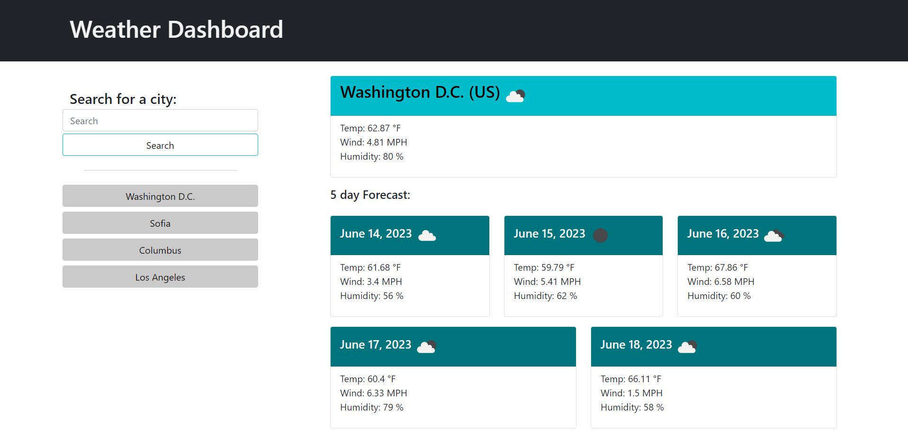

# weatherDashboard

## Description

This is  a simple application that allows a user to see the weather outlook for multiple cities in the current day a 5-day forecast. This app will run in the browser and feature dynamically updated HTML and CSS powered by jQuery.

## Installation

N/A

## Usage

You can access to the web page in: 

https://contrerassofia.github.io/weatherDashboard/

   

## License

Please refer to the LICENSE in the repo.